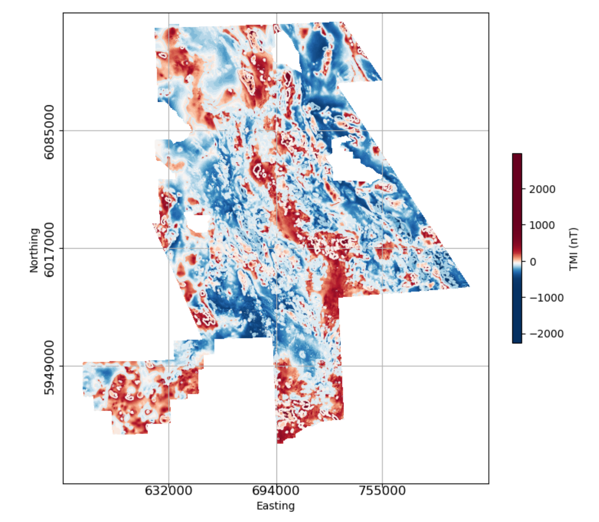

.. _search_example_intro:

2.2. Case Study Using Geoscience BC Search II Data
==================================================

We’ve now got an idea of how some common ‘geological’ features look in
magnetic data, and have been introduced to a variety of tools to help us
analyze these features. Now, let’s take a look at some real magnetic data, and
apply the same geophysical analysis tools that we applied to the synthetic
data from our simple 3D geology scenario.

For this case study, we use magnetic data from Geoscience BC’s `Search Phase
II`_ project (Bates et al., 2017). The Search Phase II magnetic gradient and radiometric survey was
flown in 2016, covering an area of 24,000 km\ :sup:`2` in west-central British Columbia
where several producing and past-producing copper and molybdenum mines are
located. East-west oriented flight lines were spaced 250 m apart. This was a
draped survey with a flight height of 80 m. Below is an image of the residual
magnetic field.

In dealing with ‘real’ data, there are some additional data preparation considerations that may need to be addressed before proceeding to data analysis and interpretation. Data cropping (to a specific area of interest), downsampling (to reduce the number of data), and gridding may need to be done. For this example we use existing gridded data making it easy to jump to visualization and interpretation. We do provide some tools in our Toolkit gallery in :ref:`Section 3<tools>` to help users do additional data preparation if required.

The links below will redirect you to sections exploring the Geophysical Toolkit applications as applied to the Geoscience BC Search II magnetic data.

.. toctree::
   :maxdepth: 1

   SearchVis

This section presents the Search Phase II magnetic data, and provides an interactive notebook for applying sunshading and image enhancements previously introduced in the synthetic modelling section to a subset of the Search II data.

.. toctree::
   :maxdepth: 1

   SearchFilters

In this section, a subset of magnetic data from the Search Phase II dataset is processed using the suite of 2D magnetic filters presented in the synthetic model case study.

**2.2.3. Edge detection and depth to source**

The edge-detection and depth to source technique previously applied to the magnetic data generated from the our synthetic 3D geologic model, is applied here to a subset of the Search Phase II magnetic data.

.. links:

.. _Search Phase II: http://www.geosciencebc.com/s/Report2017-03.asp
