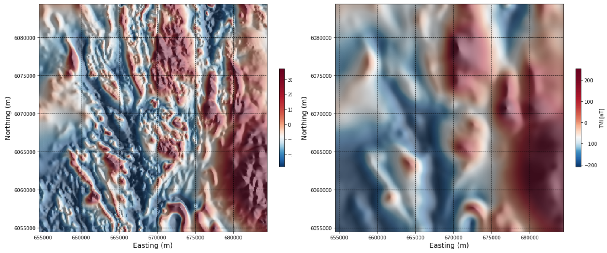
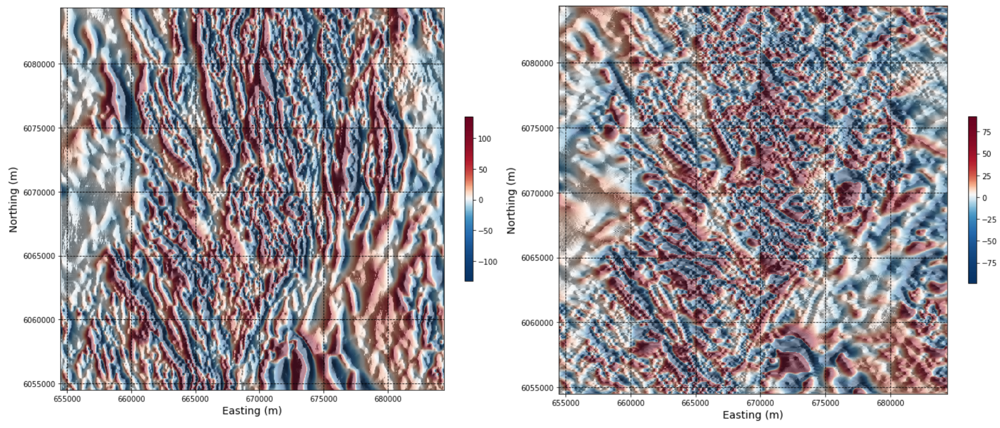
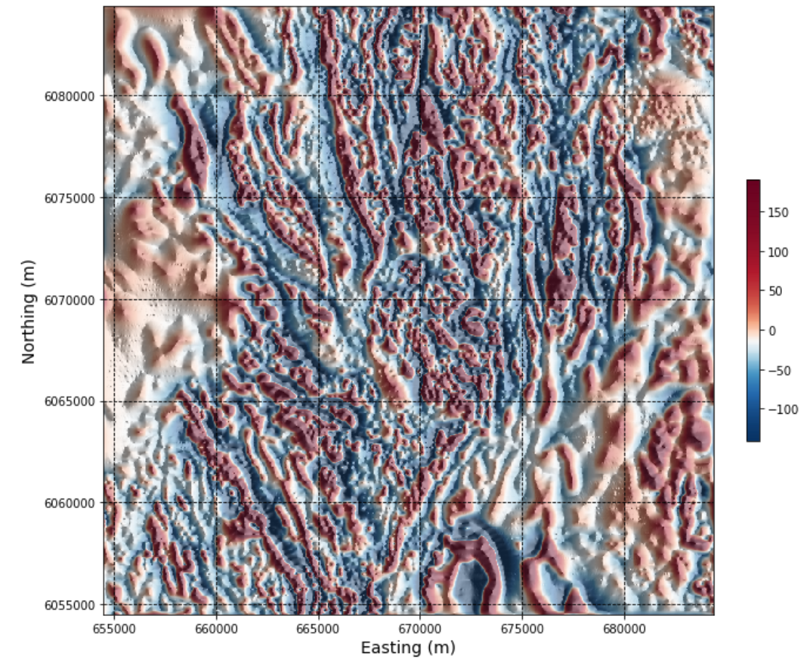
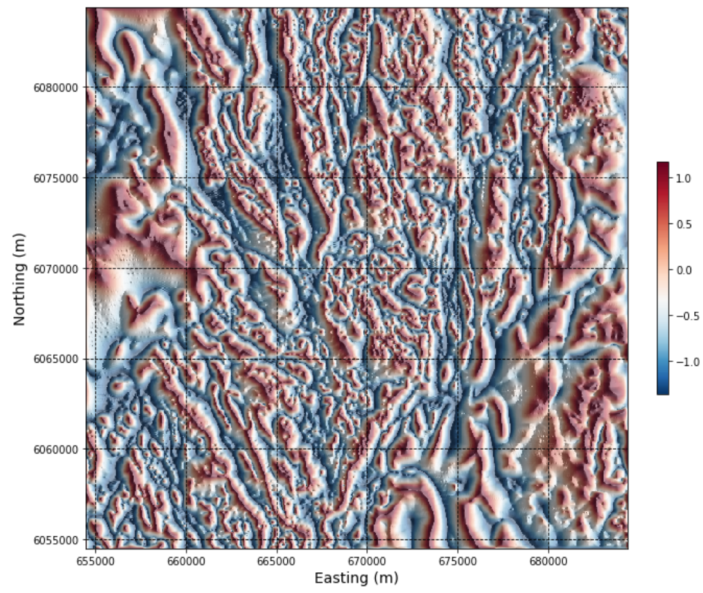

.. _search_filters:

2.2.2. Search Case Study - 2D Magnetic Data Filters
===================================================

Now let's apply our suite of 2D filters introduced in Notebook 2.1.2. to the Geoscience BC Search Phase II magnetic dataset.

Click below on the **'launch binder'** button or on the image to go to an interactive magnetic data filtering notebook, and try applying the various filters to the Search II magnetic dataset. The interactive notebook allows maps to be exported as located Tiff files for import into applications such as Google Earth or ArcMap. Or continue below for a preview of a subset of Search II data with magnetic filters applied.

.. image:: https://mybinder.org/badge.svg
    :target: https://mybinder.org/v2/gh/geoscixyz/Toolkit/main?filepath=.%2FNotebooks%2F2_2_2_Search_Mag_Data_Filters.ipynb
    :align: center

.. image:: ./images/search_filter_notebook_snapshot.PNG
    :target: https://mybinder.org/v2/gh/geoscixyz/Toolkit/main?filepath=.%2FNotebooks%2F2_2_2_Search_Mag_Data_Filters.ipynb
    :align: center

Total magnetic intensity
------------------------

Below is a snapshot of the gridded total magnetic intensity data from a subregion of the Search Phase II project, and the associated magnetic profile. The magnetic data is interpolated onto a 50 m\ :sup:`2` grid, plotted using coordinate system NAD 83 UTM Zone 9.

.. figure:: ./images/search_subset_profile.PNG
    :align: center
    :figwidth: 100 %

Upward continuation
-------------------

Upward continuation **simulates the magnetic response at increased heights above the Earth’s surface** and emphasizes longer-wavelength, deeper features, making it effective for interpretation of deep geology.

An upward continuation filter is applied to the Search Phase II data below. In the interactive notebook, try an upward continuation distance of 100 m, then 200 m. Detail in the magnetic data is lost, however certain magnetic features persist, giving interpreters a sense of the deep geology underlying the chosen study area.

X and Y derivatives of the magnetic response
--------------------------------------------

:ref:`X and Y derivatives<synthfilters_XY_deriv>` emphasize magnetic gradients in the X and Y directions, respectively. The steepest gradients occur where there are contrasts in magnetic susceptibility between adjacent rocks or due to cross-cutting structures. **Anomalies in X and Y derivative data thus peak over geologic contacts, faults, or fractures**

Grids showing the X and Y derivatives of the windowed Search Phase II magnetic data are shown below. North-south trending features are highlighted in the X derivative data, and east-west trending features highlighted in the Y derivative data.

Vertical derivative
-------------------

The :ref:`vertical derivative<synthfilters_vert_deriv>` represents the difference between the magnetic response measured at two different heights above the Earth. **First vertical derivative anomalies will highlight edges of magnetic sources, and appear over the top of the source if the contact or feature is vertical**.

The Search II data are filtered here to yield the first vertical derivative.

Total horizontal derivative
---------------------------

The :ref:`total horizontal derivative<synthfilters_tot_horiz_deriv>` is calculated by combining the X and Y derivatives. **The highest total horizontal derivative values occur at the edges or boundaries of magnetic sources**.

The total horizonal derivative of the Search Phase II data is plotted below. The map has a worm-like texture as geologic 'edges' are being emphasized.

.. figure:: ./images/Filters_search_TotHoriz.PNG
    :align: center
    :figwidth: 60 %

Tilt angle
----------

The :ref:`tilt angle<synthfilters_tilt_angle>` tilt angle normalizes the vertical derivative by the horizontal derivatives. **The tilt angle will yield a result that gives an equal emphasis to both large and smaller anomalies**. The tilt angle is positive over the magnetic source, and negative outside the source, with edges of sources delimited by the 0 degree contour.

Applying a tilt angle filter to the Search II data, we get a map with lots of anomalies. You can see more detail now in magnetically 'quiet' regions than previously seen in the X and Y derivative maps. This is very helpful for distinguishing features in weakly magnetic areas, but makes it more difficult to identify the discrete stronger magnetic anomalies in the area seen in some of the other derivative maps.

Analytic signal
---------------

The :ref:`analytic signal<synthfilters_an_sig>` or total gradient is calculated from the vertical and horizontal derivatives, accounting for magnetic contrasts in all three directions. **The analytic signal peaks immediately above narrow bodies and along the edges of larger geologic features that are in magnetic contrast to their surroundings**.

The analytic signal of the Search II data does appear to peak over the tops of, and define the extents of smaller anomalous bodies. The result shows similarities to both the first vertical derivative and the total horizontal gradient which makes sense due to the incorporation of the three gradients (X, Y, Z) in the calculation.

.. figure:: ./images/Filters_search_AnSig.PNG
    :align: center
    :figwidth: 60 %
