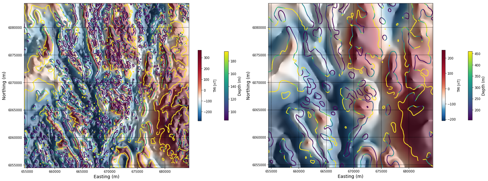
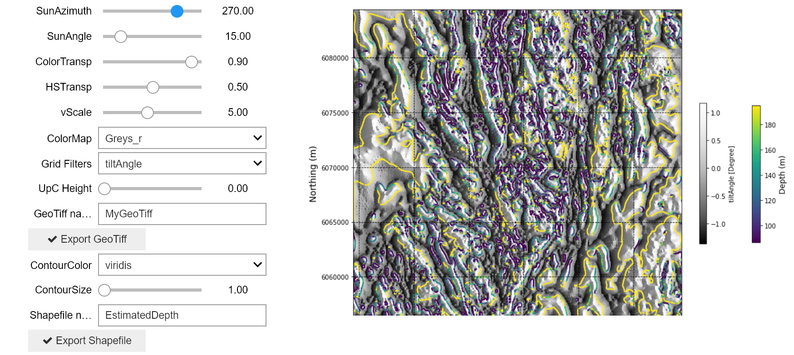

.. _search_tilt_depth:

2.2.3. Search Case Study - Edge Detection and Depth to Source
=============================================================

Here we apply the tilt-depth method discussed in :ref:`Section 2.1.5<synth_tilt_depth>`. to estimate depth to source in the Search Phase II magnetic data. Depth can be accurately derived from the tilt angle where contacts between magnetically contrasted geological units are vertical. Because of the typically complex nature of true geological contacts, calculated depths calculated from real magnetic data sets are usually approximations. The results should always be considered in light of expected geology, and ideally should be interpreted alongside geology, topographic data, and other geophysical data and models if these data are available.

The images below show the TMI overlain by the tilt-depth contours (left image), and the TMI with tilt-depth contours calculated after 100 m upward continuation is applied (right image).

Click below on the **'launch binder'** button or the image to go to an interactive notebook where you can apply the tilt-depth method to estimate the depths to magnetic sources within the Search II magnetic dataset. Upward continuation can be applied to identify the larger, more regional-scale magnetic bodies. Maps can be exported as located Tiff files, and tilt-depth contours can be exported as shapefiles.

.. image:: https://mybinder.org/badge.svg
    :target: https://mybinder.org/v2/gh/geoscixyz/Toolkit/main?filepath=.%2FNotebooks%2F2_2_3_Search_MAg_Data_DepthSource.ipynb
    :align: center

