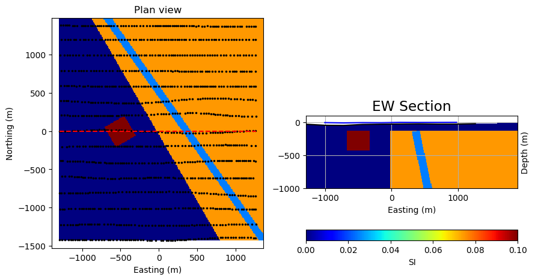

.. _synth_example:

2.1. Analysis of Simple Bodies
==============================

As a primer to interpreting magnetic data, let’s get familiar with the
magnetic responses of some simple geologic bodies. We will then grid the
magnetic data, and investigate different visual enhancements of the data, and
apply several tools that will aid us in our geological interpretation of the
magnetic data.

The geologic model
------------------

For this demonstration, a simple 3D geologic model was built attempting to
capture several different types of geologic bodies.

The geologic bodies are represented by three different blocks superimposed on a background:

**Block 1**: Large eastern magnetic domain, reflective of a magnetic plutonic complex or magnetic volcanic rock package.

**Block 2**: Small, 300 m3 strongly magnetic domain, reflective of a shallow magnetic intrusion.

**Block 3**: North-west trending, steeply-dipping non-magnetic feature inside the large magnetic block, reflective of a fault zone along which magnetite-destruction has occurred.

**Background**: Weakly magnetic background, reflective of weakly magnetic volcanic or sedimentary rocks.

The extents of the survey area are approximately 3 km x 3 km.

This geological model will be used to both demonstrate magnetic response and to showcase some of the geophysical tools available in the Geophysical Toolkit. Each processing step is presented separately in a series of Jupyter notebooks, where additional information can be found on that particular application.

Synthetic model case study notebooks
------------------------------------

**2.1.1. Magnetic data response**

**2.1.2. Magnetic data gridding and visualization**

This notebook discusses first-pass observations and image processing of magnetic data calculated from a simple 3D geologic model. It represents the initial steps an interpreter might take toward building an understanding of their magnetic dataset. In this notebook, the magnetic response of the model is calculated, magnetic profiles are viewed, the Earth's magnetic field is varied to explore the effect on response, and various color scales and stretches are applied to enhance data visualization.

**2.1.3. 2D magnetic data filters**

Total field magnetic data, viewed with sun shading or various color enhancements, is a great approach to initially exploring a magnetic dataset. Subtle variations within the magnetic data can be obscured however, usually by larger or deeper magnetic bodies. Deeper or shallower sources, and more subtle features in the magnetic data can be emphasized through the use of magnetic data filters. This notebook describes and demonstrates the effect of several commonly used magnetic data filters, including upward continuation, horizontal and vertical derivatives, analytic signal, and tilt angle.

**2.1.4. Edge detection**

Interpretation of magnetic data is ideally done by geoscientists with knowledge of the geology, lithology, and physical rock properties of typical rock types within a project area. Commonly this is done manually, through analysis of various magnetic data products discussed in the two previous notebooks, and alongside other available geoscientific data. There are however, some quick tools at our disposal to automatically pick 'edges' within magnetic data, and which may provide guidance for geologic interpretations. This notebook explains and applies one such edge detection method to magnetic data calculated from the synthetic 3D model.

**2.1.5. Depth to source**

Magnetic responses, and gradients associated with magnetic responses, can provide depth information. So we can begin to get some 3D information from our 2D datasets. This provides useful initial insight for exploration and drill planning, and also can provide a starting point for more advanced 3D geophysical modelling. There are several methods that can be applied to estimate the depth to tops of buried magnetic sources. In this notebook we demonstrate one of these methods, the tilt-depth method, and attempt to locate the depth to the top of the magnetic bodies within our synthetic geologic model.
