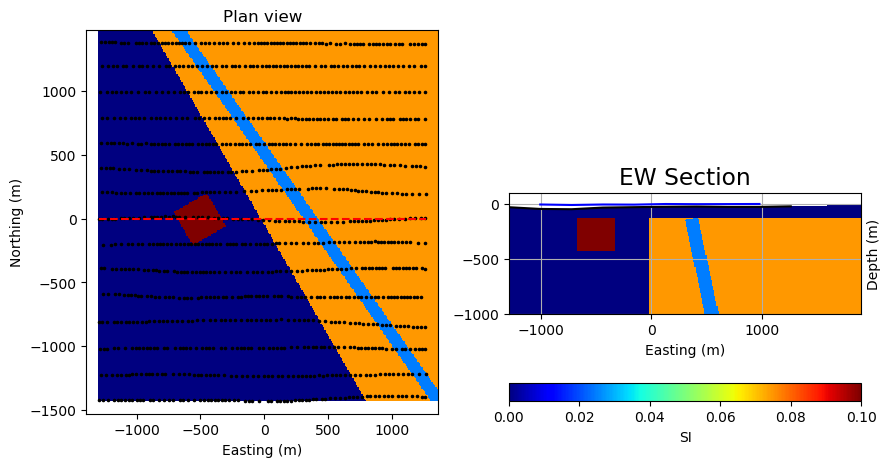

.. _synth_example_intro:

2.1. Analysis of Simple Bodies
==============================

As a primer to interpreting magnetic data, let’s get familiar with the magnetic responses of some simple geologic bodies. We will then grid the magnetic data, and investigate different visual enhancements of the data, and apply several tools that will aid us in our geological interpretation of the magnetic data.

.. toctree::
   :maxdepth: 1

   SyntheticMagResponse

Here we explore the magnetic response over our synthetic geologic model. We can view profiles through the data, and also investigate how the magnetic response varies depending on the location of the magnetic survey and the magnetic field orientation.

.. toctree::
   :maxdepth: 1

   SyntheticGridVis

This section discusses first-pass observations and image processing of magnetic data calculated from a simple 3D geologic model. It reflects the initial steps an interpreter might take toward building an understanding of their magnetic dataset. The magnetic response of the model is calculated, magnetic profiles are viewed, the data are gridded, and various image enhancements are applied to aid data interpretation.  

.. toctree::
   :maxdepth: 1

   SyntheticFilters

Total field magnetic data, viewed with sun shading or various color enhancements, is a great approach to initially exploring a magnetic dataset. Subtle variations within the magnetic data can be obscured however, usually by larger or deeper magnetic bodies. Deeper or shallower sources, and more subtle features in the magnetic data can be emphasized through the use of magnetic data filters. This section describes and demonstrates the effect of several commonly used magnetic data filters, including upward continuation, horizontal and vertical derivatives, analytic signal, and tilt angle.         

.. toctree::
   :maxdepth: 1

   SyntheticTiltDepth

Interpretation of magnetic data is ideally done by geoscientists with knowledge of the geology, lithology, and physical rock properties of typical rock types within a project area. Commonly this is done manually, through analysis of various magnetic data products discussed in the two previous notebooks, and alongside other available geoscientific data. There are however, some quick tools at our disposal to automatically pick 'edges' within magnetic data, and help us to approximate source depth. The resulting products can provide further guidance for geologic interpretations. This section explains and applies one such edge and depth detection method to magnetic data calculated from the synthetic 3D model.   
 