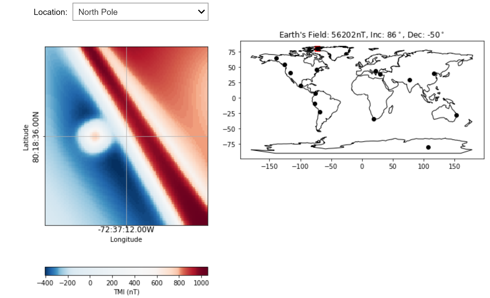

.. _synth_mag_response:

2.1.1. Synthetic - Magnetic Data Response
=========================================

The geologic model
------------------

For this demonstration, a simple 3D geologic model was built attempting to capture several different types of geologic bodies.

The geologic bodies are represented by three different blocks superimposed on a background:

**Block 1**: Large eastern magnetic domain, reflective of a magnetic plutonic complex or magnetic volcanic rock package.

**Block 2**: Small, 300 m\ :sup:`3` strongly magnetic domain, reflective of a shallow magnetic intrusion.

**Block 3**: North-west trending, steeply-dipping (-80 degree dip), non-magnetic feature inside the large magnetic block, reflective of a fault zone along which magnetite-destruction has occurred.

**Background**: Weakly magnetic background, reflective of weakly magnetic volcanic or sedimentary rocks.

The extents of the survey area are approximately 3 km x 3 km.

.. image:: ../../Notebooks/images/SyntheticModel.png

Magnetic response of a simple geologic model
--------------------------------------------

The magnetic response (total field anomaly) of the geologic model is calculated on a series of east-west flight lines running roughly perpendicular to the general strike of geologic boundaries and structures featured in the model. Flight line spacing is 200 m. Data was collected at a flight height of 40 m. Topography is assumed to be flat in this example. 

.. figure:: ./images/GeoTIFFSynthetic.png
    :align: center
    :figwidth: 40 %

An east-west profile through the magnetic data is shown below. The responses of the smaller and larger magnetic blocks are obvious in this profile, and occur directly over the sources (due to the magnetic field inclination being vertical in this example). The fault within the large eastern magnetic block is observed as a more subtle dip in the magnetic response, slightly offset from the top of the body due to its northeasterly dip.

.. figure:: ./images/synthEWprofile.PNG
    :align: center
    :figwidth: 100 %

Magnetic field effect on response
---------------------------------

As discussed in Section 1 on the Toolkit website (Magnetic Data - Background), the magnetic response will depend on the inclination, declination, and field strength of the magnetic field at the survey location. The image below shows the magnetic response at the geographic North Pole, where the Earth's magnetic field is near-vertical.

Click here to open an interactive notebook to explore the magnetic response of the synthetic geologic model.

