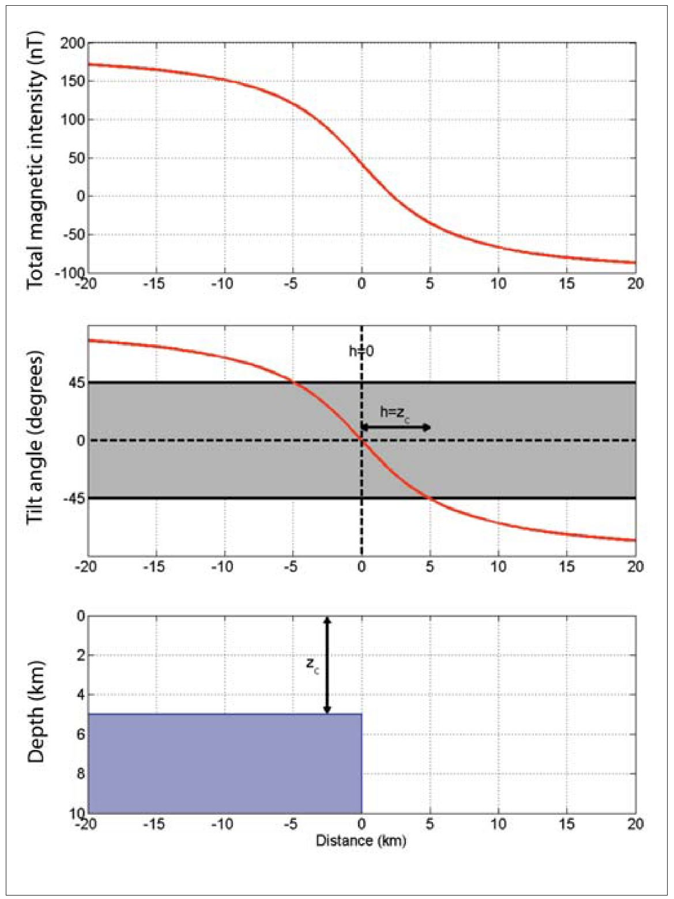
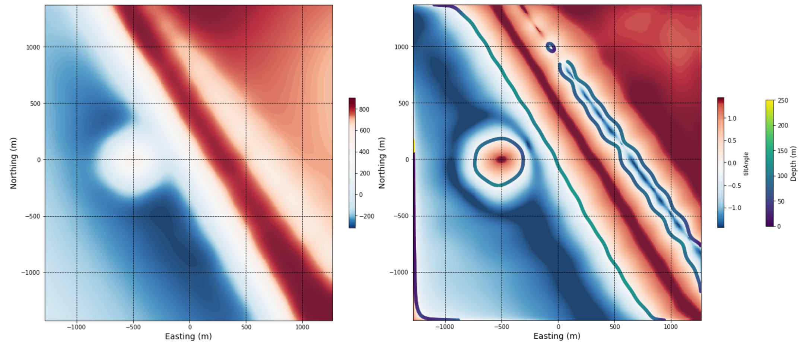

.. _synth_tilt_depth:

2.1.4. Synthetic - Edge Detection and Depth to Source
=====================================================

Additional useful information to aid geologic interpretation can be derived from a suite of high quality magnetic data, again using some simple techniques. Source edges and depths can be estimated from magnetic gradients where there is sufficient magnetic susceptibility contrast between adjacent geologic bodies or features.

Analyzing the depth to a magnetic source is valuable for many reasons. Having an approximation of the depth of a body, especially if it is expected to represent ore, is invariably useful for planning drill targets. For some geologic bodies, such as porphyry intrusions, the shape or topography of the intrusion can indicate locations of high fluid flow. Results of depth to source modelling can be used as a guide and starting point for 3D geological modelling or further exploration of the shape of the anomaly using forward modelling or inversion techniques. Depending of course on the physical properties, specifically the magnetic susceptibility, of the rock types within a study area, and their distribution, it is possible to find the depths to not only compact magnetic bodies, but depth to basement below cover, or depths to magnetic stratigraphic horizons.

We use the **tilt-depth method** (Salem et al., 2007, Blakely et al., 2016) to find the edges and depths of both the small high magnetic susceptibility body and the larger magnetic block in the 3D synthetic geologic modeldo this. The tilt angle, discussed in Section 2.1.3., considers the vertical and horizontal magnetic gradients. Depth can be estimated where the tilt angle is zero, at the edge or margin of a feature or source. Depth to the edge of a source is then approximately half the distance between the +45 degree and -45 degree contours of the calculated tilt angle.

(Figure from Salem et al., 2007)

Click here to go to an interactive notebook where you can apply the tilt-depth method to estimate the depths to magnetic sources with the synthetic geologic model. 

