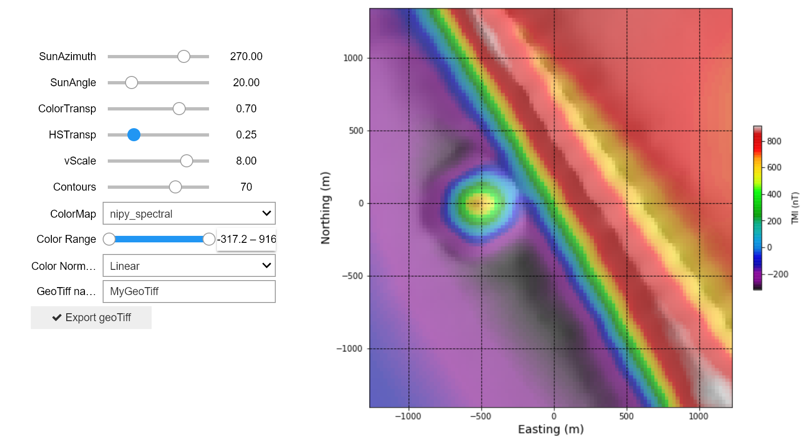
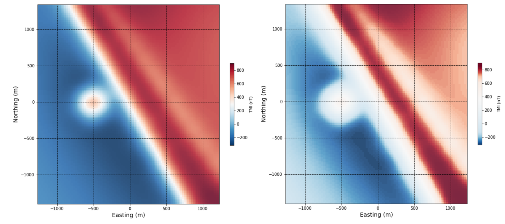

.. _synth_vis:

2.1.3. Synthetic - Magnetic Data Visualization
==============================================

Data visualization and image enhancement
----------------------------------------

Simple enhancements to the image can help an interpreter better visualize features within magnetic data. Applying sun-shading from various angles, experimenting with different colour maps, and colour stretches are a simple means to explore the data initially.

Click on the **'launch binder'** button to try out various image enhancement schemes using the synthetic magnetic data. To launch the notebook in a new tab, right-click on the **'launch binder'** button and choose **'Open link in new tab'**. Some details on image and colour enhancements and examples are given below.

.. image:: https://mybinder.org/badge.svg
    :target: https://mybinder.org/v2/gh/geoscixyz/Toolkit/main?filepath=.%2FNotebooks%2F2_1_3_Synthetic_Mag_Data_Visualization.ipynb
    :align: center

**Sun-shading**. Sun-shading (:cite:`Horn1981`, :cite:`Cooper2003`), or hill-shading can be used to emphasize highs and lows in the magnetic data - magnetic highs appear as topographic highs, and magnetic lows as topographic lows. This can help interpreters see more subtle variations in the data. Sun-shading can be oriented in any azimuth, and at any angle from 0 to 90 degrees. It helps to choose an aziumth that is perpendicular to the overall geological strike of the study area, and an angle that is neither too shallow or deep.

The left and right images show the synthetic magnetic data without and with sun-shading applied.

.. figure:: ./images/no_shading_vs_shading.png
    :align: center
    :figwidth: 100 %

**Color maps**. Some color maps will do an obviously better job of enhancing a large range of features (color maps with a larger color range for example), while others may be used to highlight specific ranges of data, and yet others used simply because of an interpreter's personal preference. Choice of color map is an often-debated topic in geophysics and in other fields requiring image analysis (e.g. :cite:`Light2004`, :cite:`Borland2007`, :cite:`Niccoli2012`, :cite:`Froner2013`). An important point to consider is that some color maps have the 'brightest' colors at the top of the scale, for example, grey scale and viridis:

.. figure:: ./images/gray_15per_ppt.PNG
.. figure:: ./images/viridis_15per_ppt.PNG

whereas others have the brightest color in the mid-ranges, for example, rainbow, jet, and red-blue:

.. figure:: ./images/rainbow_15per_ppt.PNG

.. figure:: ./images/redblue_15per_ppt.PNG

This color ordering can be deceptive to the eye of an interpreter who is sensitive to color contrast. A color map with the brightest color in the mid-ranges and may cause problems if a map is printed in greyscale - suddenly mid-range values are the most brightest and seemingly anomalous features. Having bright colors in the mid-range however, may be useful for visually separating areas of high versus low magnetic response.

The upper right image below displays the data using the red-blue colour map, and the upper right image displays the data using the viridis colour map. The two lower images show how these upper images look with a grayscale applied. You can see how the features in the data are differently emphasized depending on their original colour map.

.. figure:: ./images/color_maps_and_grayscale.png
    :align: center
    :figwidth: 100 %

**Color stretch**. Using a linear stretch, the values within a range of magnetic data are mapped to 256 classes or bins within a chosen color map in a linear manner, meaning if there are few anomalously high values (outliers) in the range, the 'strongest' color values will be mapped rarely. If there are many middle-range values, the image may be flooded with mid range color values. While a linear color stretch will highlight the most anomalous values, it can wash out subtler features in the data. Histogram equialization will vary the color bin sizes to map an equal number of data points per bin, essentially giving equal weight to low, mid-range, and high magnetic values.

The left image shows the data displayed using a linear colour stretch, and the right image shows the data displayed using a histogram equalized colour stretch.

