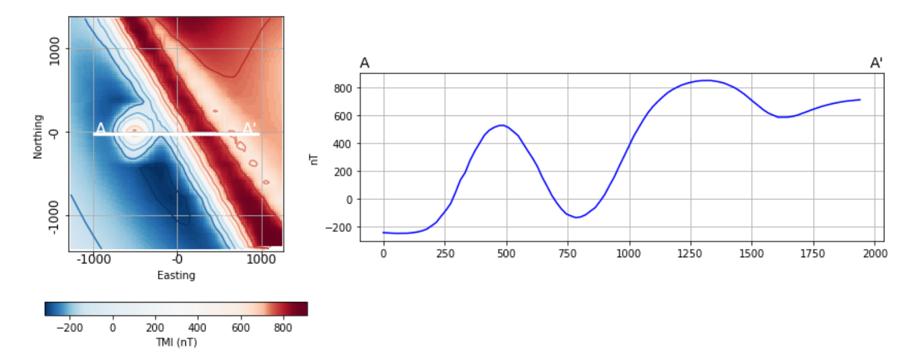
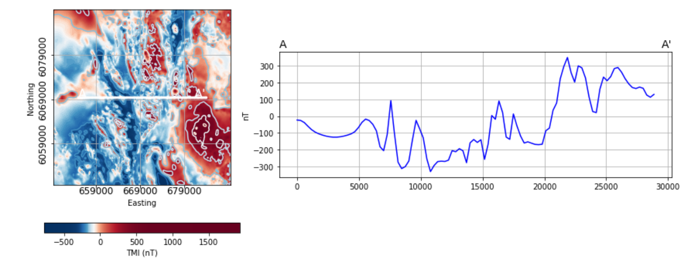

.. _demos:

2. Magnetic Data Analysis - Case Studies
========================================

In this section, we provide examples and interactive demonstrations to introduce geoscientists to the magnetic data analysis tools available in the Geophysical Toolkit for Geologists.

The first example provided considers a simple geological scenario from which a magnetic response is calculated and analyzed. This section will help familiarize users with magnetic responses over compact and planar geologic bodies, demonstrate how the response can vary depending on the local magnetic field, and provide an introduction to several magnetic data visualization and analysis tools.

The Toolkit tools are then applied to analyze a real-life magnetic data set from Geoscience BC’s Search Phase II project area.

Contents:

.. toctree::
   :maxdepth: 1

   SyntheticExample
   SearchExample

