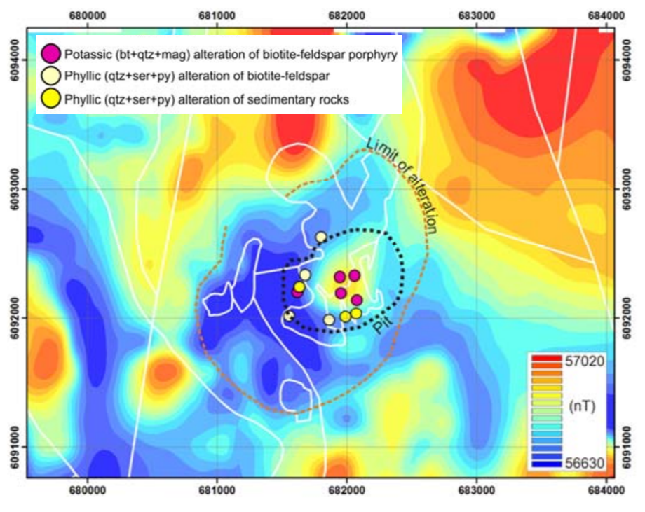
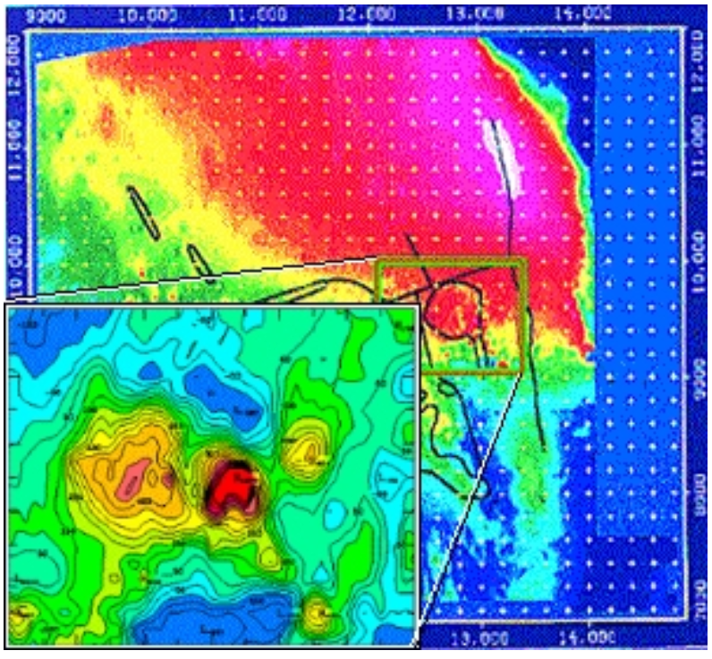
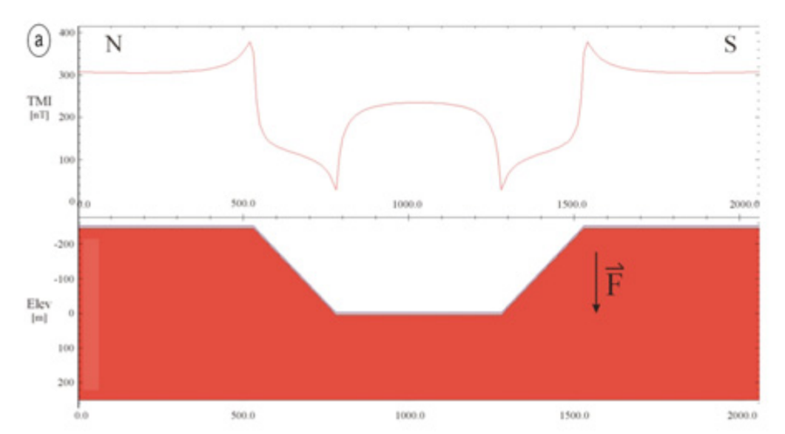

.. _interp:

4. Magnetic Data Interpretation - Considerations
================================================

Important things to consider before and during interpretation of magnetic data
------------------------------------------------------------------------------

:cite:`Dentith2014` provides a good summary of geophysical data interpretation fundamentals. Some of these important topics are elaborated on in the below sections.

Rock Properties
---------------

**Collection of magnetic susceptibility data from representative rock types, and their altered equivalents, within a project area is an important pre-requisite to geologic interpretation of magnetic data.** This data provides confidence for interpretatation and is critical data for any kind of advanced forward or inverse geophysical modelling that allows geoscientists to model geology in 2D and 3D in the subsurface. Left shows an image of variably altered porphyry deposit samples and their relationship to magnetic response (:cite:`Mitchinson2013`). In the complete absense of rock property data from a project area, rock property data from an area with known equivalent rock types can be useful in guiding interpretation. Or else, interpreters can spend some time in the initial stages of data evaluation simply comparing geophysical data to geology recorded on maps to try to identify consistent patterns that may indicate that particular lithologies are generally weakly, moderately, or strongly magnetic. The magnetic susceptibility table shown :ref:`here<magnetic_susceptibility_chart>` demonstrates the large range in magnetic susceptibility values recorded for different common rock types. While very broad differences in average magnetic susceptibilities of different lithologies are discernable from such a table, interpreters should avoid assuming these averages are representative of the rock types in their project area.

Responses from cover sequences
------------------------------

**It is common for overburden material, or cover sequences to be magnetically transparent, but it is not always the case!** Eroded or glacially derived material that is has not undergone significant weathering can contain magnetite or other magnetic minerals. Magnetite is also rarely formed in particular surficial environments. Magnetite or other magnetic minerals in cover sequences might be recognized from surficial material studies (laboratory or petrographic analyses), or their presence may be noticed in the character of the magnetic response. The interpreter should question whether a response is consistent with expectations of what the bedrock geology is, or if it diverges from that. Shallow or surficial magnetic responses will likely be best identified in high resolution magnetic data or in filtered data products that emphasize subtle magnetic features. It should be noted however that noise can also be over-emphasized in particular filtered magnetic products such as second vertical derivative and downward continuation, and care should be taken to not misinterpret noise as surficial response.

Depth of magnetic source, and interfering sources
-------------------------------------------------

.. image:: ./images/Dentith_Mudge_shallow_deep_interp.png
    :align: right
    :width: 60%

Often magnetic (and other geophysical data) are used to interpret geology and to build geologic maps where rock exposure is limited. Magnetic anomalies however, may represent several superimposed magnetic sources. **The interference of sources is a difficult problem, and individual bodies are unlikely to be distinguished from one another unless surficial mapping or drilling information supports the existance and location of distinct bodies.** To thoroughly address varying source depths during map-making, lithologic contacts could be digitized with an indication of their interpreted depths. Alternatively, two or more maps can be generated with geologic information interpreted at shallow and deep levels (:cite:`Isles2013` provides an excellent example of this as illustrated in the image to the right). Depth information, as discussed and demonstrated in :ref:`Section 2<demos>`, can be assessed using various magnetic filters (vertical derivatives, and upward continuation), or estimated using depth to source methods.

Regional context and regional signal removal
--------------------------------------------------

It is typically very useful to acquire and plot regional magnetic data (and
regional geology) for comparison with the local project data. This provides
some context for the local data. **Anomalies within the local dataset may extend
beyond the boundaries of the project, and seeing their full extent can provide
valuable insight on the geologic setting**. Local anomalies may also be part of
a suite or chain of anomalies, which might not be recognized without viewing
regional data. Regional magnetic and gravity data can commonly be found on the
websites for provincial, state, or national geological surveys. **Regional
magnetic data can also reveal whether large wavelength magnetic responses
might need to be removed from more local magnetic datasets**. Large, deep
magnetic sources can obscure locally important discrete bodies. A discussion
of regional magnetic trend removal, and an example from the Mount Milligan porphyry deposit region (left), is found on the `Geophysics for Practising Geoscientists website <https://gpg.geosci.xyz/content/magnetics/magnetics_processing.html#removal-of-regional-trends>`_. 

Compare with other available data
---------------------------------

The most important, and impactful, strategy for interpreting geology from magnetic data is analyzing the data in tandem with all other available geoscientific data. Most 2D and 3D mapping and modelling software platforms allow geoscientists to bring many types of geoscientific data together to carry out exploratory data analysis and complete thorough and supported interpretations.

.. image:: ./images/survey_lines_AS_White_Beamish.PNG
    :align: right
    :width: 70%

+ **Survey lines and data** - If magnetic data is not appropriately corrected, there is potential for survey lines and survey points to appear in the data. It is important then to plot magnetic grids along with the survey lines to confirm whether the lines are visible within the data, which we do not wish to unintentionally interpret as real geological features. This survey noise may be most identifiable in vertical or horizontal derivative, or downward continued data. Diurnal variation corrections, micro-levelling (e.g. :cite:`Minty1991`, and :cite:`White2015` image above right), and tie-line levelling normally is applied to reduce or eliminate survey noise.

+ **Infrastructure** - Man-made metal structures and buildings can cause a response in magnetic data. Often, towns and cities will be avoided by magnetic surveys and will not cause a problem, but isolated structures may be surveyed. It is always a good idea to view satellite data (e.g. Google Earth) or air phorographs to determine if there are any correlations between infrastructure and magnetic data.

+ **Topographic data** - It is important to review topographic data along with magnetic data. Normally, topography is corrected for during magnetic data processing, but it's possible that not all effects of topography will be removed, especially in rugged, mountainous areas (e.g. :cite:`Ugalde2008` - image to the right demonstrates the topographic influence on magnetic data for a synthetic model). Closely inspecting both datasets will help to identify any topographic noise, reducing the chance of misinterpretation of the magnetic data. It should be remembered, however, that there could be natural correlations between topography and magnetic data where for example, magnetic rocks are differentially weathered from non-magnetic rocks. Topographic data often accompanies magnetic data, however it can easily acquired through government natural resources databases (e.g. `Geogratis`_).

+ **Geology** - Of course having geological information to guide magnetic data interpretation is optimal. A few disclaimers are required however. Geology maps from areas of very little outcrop exposure may have been primarily interpreted from magnetic data! Outcrop and field observations (e.g. mapped geologic contacts) should be regarded as first-order constraints for interpreting magnetic data. Again, however, as alluded to in the section above discussing depth of magnetic sources, a rock mapped at the surface, may be underlain or superimposed by a deeper magnetic source. So it is possible for a surface observation and magnetic data to appear inconsistent. Remember, magnetic data represents a 3D distribution of variably magnetic sources within the subsurface. This is why rock property data collection is important - to confirm whether what is found at surface is consistent with what we observe in magnetic data.

.. image:: ./images/YGS_Mira_Yukon_Tanana_interp.PNG
    :align: right
    :width: 70%

+ **Gravity** - It is beneficial to compare gravity data, if available, with magnetic data. Gravity data often corroborates features observed in magnetic data. This is more often true of regional scale features, such as plutonic complexes, large scale volcanic or sedimentary sequences, large magnetic ore bodies, or regional structures (e.g. image above right, integrated geologic interpretation from magnetics and gravity data from Yukon Territory :cite:`YGS2014`). These may be positive or negative correlations, in other words, highs in magnetic and gravity data may occur together, or one response may be high while the other is low. At local scales, more heterogeneity will be revealed in the data, and correlations may be more difficult to make. Gravity and magnetic data should not be expected to always correlate, since the responses are controlled by very different parameters of the rock. In the case of gravity, responses are controlled primarily by the mineralogy (abundance of high density versus low density minerals) and porosity of the rock, and in the case of magnetics, responses are controlled primarily by the abundance of magnetic minerals.

.. image:: ./images/MDRU_SRK_Iran_interp.PNG
    :align: right
    :width: 70%

+ **Other remote-sensing and geochemical data** - Any and all other kinds of geoscientific data, and/or previous interpretations that researchers have made of these data will be helpful in guiding interpretations of magnetic data. Electromagnetic data can help identify or verify areas and extents of conductive cover rocks, distributions of more resistive lithologies, conductive ore bodies, and structure. Radiometric and spectral data can highlight various geologic domains, or zones of alteration affecting the rocks (e.g. the image to the right shows an integrated interpretation of magnetic and spectral data from the Kerman Belt, Iran :cite:`Fonseca2016`). Geochemical data will help identify related groups of rocks, and alteration footprints. 

Magnetic data interpretation resources
--------------------------------------

:cite:`Isles2013`
:cite:`Dentith2014`
:cite:`Blakely1996`

.. links

.. _GeoGratis: http://geogratis.cgdi.gc.ca/
