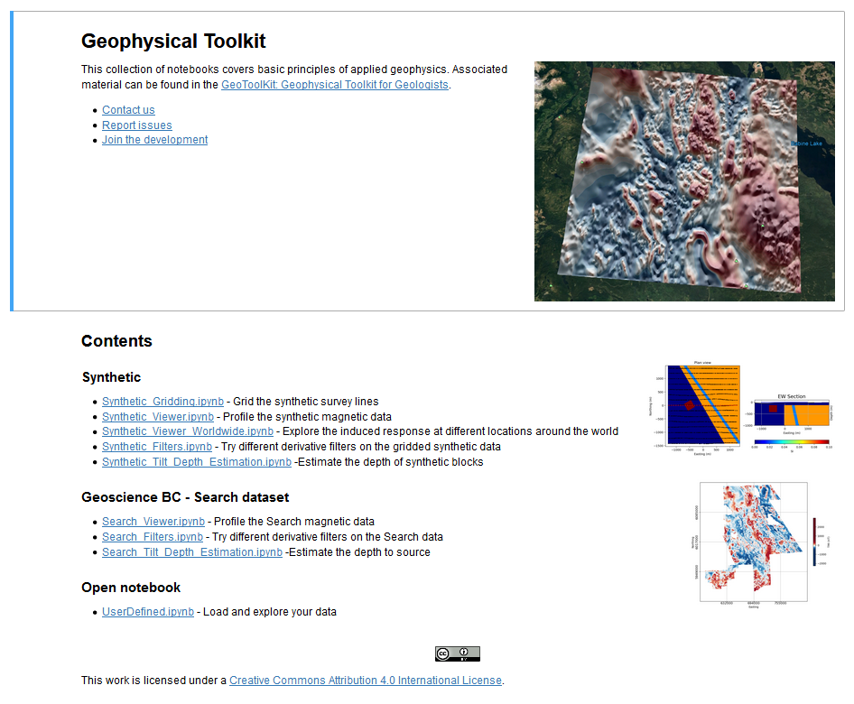

Geophysical Toolkit for Geologists
==================================

 .. .. image:: ./images/intro.png
 ..   :width: 200 px
 ..   :alt: intro
 ..   :align: right

Welcome geoscientists looking to get more from your magnetic data!

The **Geophysical Toolkit for Geologists** was developed to provide guidance and an easy entryway for geoscientists to explore magnetic data.

.. figure:: ./images/draped_mag_search.PNG
    :align: center
    :figwidth: 75 %

This site provides a portal to a suite of basic geophysical tools or applications that can aid geological interpretation of magnetic data. The content and applications here were assembled as part of a project initiated between UBC’s `Mineral Deposit Research Unit`_ and the `Geophysical Inversion Facility`_. Magnetic data was focused on for this particular Toolkit, due to the usefulness and common availability of this type of geophysical data. However, applications for analysis of other geophysical data types may be added in the future.

**Magnetic data can provide great insight into geology at and below the Earth’s surface**. Magnetic data is of particular use where geology is concealed by weathering or overburden, as this cover material is often magnetically ‘transparent’. The distribution of lithological units, and geologic structure can be interpreted helping geoscientists piece together a more complete picture of the Earth’s subsurface.

.. figure:: ./images/tilt_depth_over_tmi.PNG
    :align: center
    :figwidth: 80 %

Some **background information** related to the Earth’s magnetic field, magnetic response of rocks, and magnetic data collection are provided in an :ref:`introductory section<Mag_index>`.

To get initiated with the **geophysical data analysis tools** in the **Geophysical Toolkit**, we have set up both :ref:`synthetic<synth_example_intro>` and :ref:`real-life<search_example_intro>` examples that can be walked through by interested geoscientists looking to understand how the tools function. :ref:`Users can also directly upload their own data<usertools>` to apply and explore the same applications.

Geological knowledge is vital to meaningful interpretation of geophysical data. Therefore, geophysicists and geologists must work together to gain the maximum value from geophysical data! Neither the geophysicist nor the geologist needs to be an expert in the other’s field, they simply need to bring their respective skills and knowledge to the table and start a conversation.

Contents:
^^^^^^^^^

.. toctree::
   :maxdepth: 1

   content/Magnetics/Mag_index
   content/Demos/demos
   content/Tools/tools
   content/Interp/interp
   references

The Apps
^^^^^^^^

.. image:: https://mybinder.org/badge.svg
    :target: https://mybinder.org/v2/gh/geoscixyz/Toolkit.git/master?filepath=.%2Fdocs%2FNotebooks%2Findex.ipynb
    :align: center

Feedback:
^^^^^^^^^

Have comments or suggestions? Submit feedback here_.

All the content can be found on our github_ repository.

.. _here: https://docs.google.com/forms/d/1Bv43lKncKaTQY3_J_B1DrPQr0ft0Qt1x6IjqM7iDbnc/viewform?usp=send_form>`.

.. _github: https://github.com/ubcgif/gpg

Contributors:
^^^^^^^^^^^^^

.. include:: AUTHORS.rst

.. image:: ./images/MDRU.png
   :scale: 100%
   :align: left

.. image:: ./images/GIF.png
   :scale: 100%
   :align: left

.. Indices and tables
.. ==================

.. * :ref:`genindex`
.. * :ref:`modindex`
.. * :ref:`search`

.. _Mineral Deposit Research Unit: https://www.mdru.ubc.ca/

.. _Geophysical Inversion Facility: https://gif.eos.ubc.ca/