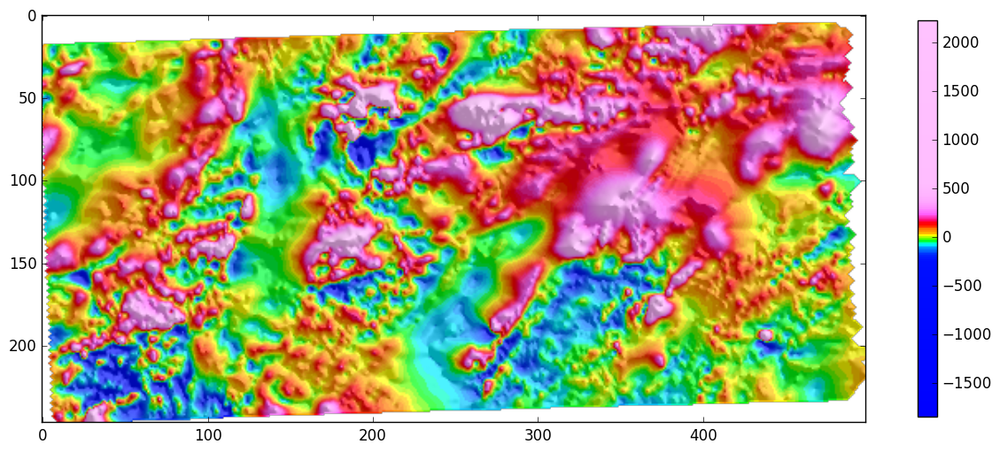

# graphics
Collection of functions for creating and manipulating graphics, colormaps and plots with Python and matplotlib.

These functions are essentially used to display 2D arrays with a modified version of `pyplot.imshow`. The new function is called `imshow_hs` and it accepts a number of parameters to add elements such as colorbar, contours and hillshading to the plot.

## Usage of `imshow_hs`

**The best way to learn about the parameters of `imshow_hs` is to run the `how_to_use_imshow_hs.ipynb` jupyter notebook.**

This function is a combination of `imshow` with `contours` and `LightSource` for applying hillshading effects to the display of 2d arrays. The colormap can be normalised by equalisation or by clipping the extremes (autolevels).
Most of the parameters of `pyplot.imshow` can be passed to `imshow_hs` as keyword arguments.
The default usage is:
```
import graphics
graphics.imshow_hs(data)
```
This produces a figure with the array (data) displayed with a colorbar and hillshading generated by a light source in the northeast corner. The default colormap is *clra*: it comes from Oasis Montaj by Geosoft and is widely used in exploration geophysics. Histogram equalization is applied by default to improve the contrast of the resulting image.

Here is an example using the default behaviour on a grid of aeromagnetic data from the USGS.




